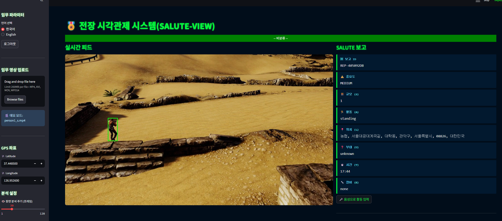

<div align="center">

# 🎖️ Tactical Scene Narrator (SALUTE‑VIEW)
**전장 시각관제 시스템 – 실시간 SALUTE 보고서 자동 생성 파이프라인**

[](https://www.python.org/)
[](LICENSE)
[](https://github.com/ultralytics/ultralytics)
[](https://huggingface.co/llava-hf)

</div>

---

## ✨ Why SALUTE‑VIEW?

> 인간 관제사는 **1 시간짜리 드론 영상 중 평균 3–4 분**만 집중한다 – 美 육군 실험  
> 결과적으로 보고 누락·지휘 지연·AAR 작성 부담이 초래됩니다.

SALUTE‑VIEW는 **탐지 ⇢ 추적 ⇢ 멀티모달 캡션 ⇢ 규칙 기반 파싱**을 한 번에 처리하여  
💡 *“영상‑기반 SALUTE 보고서 자동화”* 를 최초 데모 수준으로 구현합니다.

<p align="center">
  
</p>

---

## 🏗 System Architecture

```text
┌────────────┐     Frame(1 fps)      ┌──────────────┐
│Video Ingest│ ────────────────────▶ │YOLOv8s+ByteTr│  Box+ID
└────────────┘                       └──────────────┘
        │                                  │
        │Frame w/ overlay                  │
        ▼                                  ▼
┌─────────────────────┐   Prompt: “Describe …”  ┌────────────┐
│     LLaVA‑1.6       │◀───────────────────────┤FrameBuffer │
└─────────────────────┘    Caption(txt)        └────────────┘
        │ SALUTE‑Regex / GPT‑4o
        ▼
┌─────────────────────┐
│   SALUTE Extractor  │──▶ JSON Stream ─▶ UI(Log panel)
└─────────────────────┘
        │
        │ Lat/Lon → Addr (Nominatim)
        ▼
┌──────────────┐
│   HUD Overlay│ (cv2.putText)
└──────────────┘
````

---

## 🚀 Quick Start

### 1) 로컬 실행

```bash
git clone https://github.com/<YOUR_ID>/tactical-scene-narrator.git
cd tactical-scene-narrator
python -m venv .venv && source .venv/bin/activate
pip install -r requirements.txt

# 드론 데모 영상 실행
python tactical_scene_narrator.py \
    --source demo/person1_s.mp4 \
    --lat 37.44 --lon 126.95
```

### 2) Streamlit Dashboard

```bash
streamlit run streamlit_app.py
# 브라우저: http://localhost:8501
```

> **TIP:** Hugging Face 무료 플랜은 30 req/min 제한이 있으니 데모 영상은 1 fps로 재생하세요.

---

## 🧩 Project Layout

```
.
├── tactical_scene_narrator.py   # Core pipeline (≈280 LoC)
├── streamlit_app.py             # Web UI
├── modules/                     # ByteTrack, SALUTE parser 등 분리
├── demo/                        # 샘플 MP4
├── requirements.txt
└── README.md
```

---

## 🔧 Key Dependencies

| Module             | Version | Why         |
| ------------------ | ------- | ----------- |
| Ultralytics YOLOv8 | 8.x     | 객체 탐지       |
| ByteTrack          | latest  | ID 유지 추적    |
| LLaVA‑1.6          | HF API  | 이미지 캡션      |
| OpenCV             | 4.x     | 영상 IO & HUD |
| Streamlit          | 1.x     | 대시보드 UI     |

---

## 📊 Performance

| Stage                    | Latency (RTX 3060) |
| ------------------------ | ------------------ |
| YOLOv8s + ByteTrack      | \~11 ms            |
| LLaVA API (Tokyo region) | 400–600 ms         |
| 전체 파이프라인 (1 fps)         | 실시간 처리 가능          |

---

## 🗺 Roadmap

* [ ] 📦 Docker image 배포
* [ ] 🔌 Edge‑LLM (Phi‑3) 로컬 inference 옵션
* [ ] 🌐 다국어 캡션 & SALUTE 파서
* [ ] 🛰 Multisensor Fusion (SAR / RF)
* [ ] 🧪 Unit test coverage > 90 %

---

## 🤝 Contributing

버그 리포트, 기능 제안, PR 모두 환영합니다.
`issues/` – 새 이슈 등록 → `fork` → `feature/<name>` 브랜치 → PR!

---

## ⚖️ License

본 프로젝트는 **AGPL‑3.0** 라이선스를 따릅니다.
YOLOv8 원본 라이선스 요건을 준수해야 합니다.

---

## 📑 Citation

```
@misc{saluteview2025,
  title   = {Tactical Scene Narrator (SALUTE-VIEW)},
  author  = {Jeong, D.Y.},
  year    = {2025},
  howpublished = {\url{https://github.com/DayenaJeong/tactical-scene-narrator}}
}
```

---

<div align="center">
Built with ☕, 🛰, and a healthy dose of ✨ engineering discipline.
</div>

